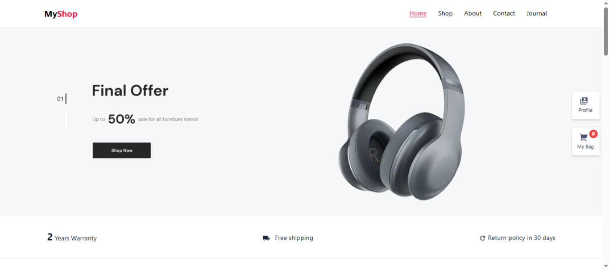
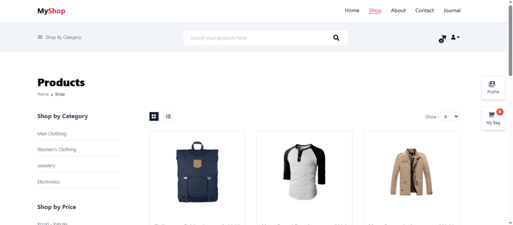
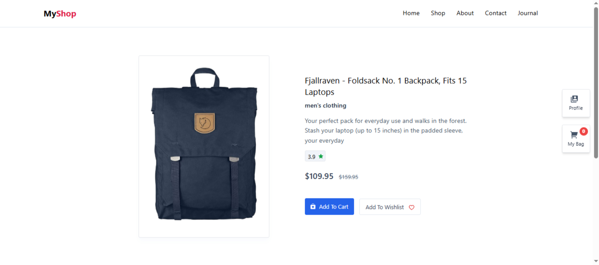
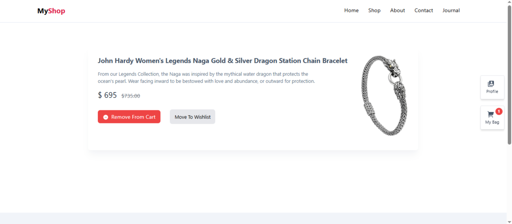

# 🛍️ MyShop — E-Commerce Web Application

A modern **e-commerce web application** built with **React.js**, designed to demonstrate real-world frontend engineering practices through product browsing, search and filtering, shopping cart management, wishlist functionality, product comparison, and a structured, component-based architecture.

---

## 🌐 Live Demo

**[View Live Application](https://my-shop-okas.vercel.app/)**

---

## 📦 Repository

**[View Source Code](https://github.com/Musaib-Naseem/MyShop)**

---

## ✨ Features

### 🛒 Shopping Experience

- Browse products from multiple categories
- Product search
- Category-based filtering
- Price-range filtering
- Product pagination
- Product details
- Add products to cart
- Shopping cart management
- Product quantity management

### 🎨 UI & UX

- Clean and modern e-commerce interface
- Reusable UI components
- Category navigation
- Product cards
- Shopping cart interface
- Interactive buttons and controls
- User-friendly shopping experience

---

## 📸 Screenshots

### 🏠 Home Page



### 🛍️ Shop Page



### 📦 Product Details



### 🛒 Shopping Cart



---

## 🛠️ Tech Stack

| Technology       | Purpose                     |
| ---------------- | --------------------------- |
| React.js         | UI development              |
| JavaScript       | Application logic           |
| Redux            | State management            |
| React Router     | Client-side routing         |
| CSS              | Styling                     |
| Create React App | Development & build tooling |
| REST API         | Product data                |

---

## 🧠 Frontend Concepts Demonstrated

This project demonstrates practical frontend engineering concepts including:

### Component-Based Architecture

- Reusable React components
- Modular component structure
- Separation of UI responsibilities
- Reusable product and layout components

### State Management

- Global application state
- Cart state management
- Wishlist state management
- Product comparison state
- User-related state

### Product Management

- Dynamic product rendering
- Product filtering
- Category filtering
- Price filtering
- Product search
- Pagination

### Routing

- Client-side navigation
- Product detail routes
- Shop routes
- Navigation between application sections

### API Integration

- Fetching product data
- Rendering dynamic API responses
- Handling product information
- Integrating frontend UI with external data

---

## 📂 Core Functionality

### Product Browsing

Users can:

- Browse available products
- Search for products
- Filter products by category
- Filter products by price
- Navigate through product pages
- View detailed product information

### Shopping Cart

Users can:

- Add products to the cart
- Remove products
- Increase product quantity
- Decrease product quantity
- View cart items
- Track cart item count

### Wishlist

Users can:

- Add products to wishlist
- Remove products from wishlist
- Manage saved products

### Product Comparison

Users can:

- Select products for comparison
- Compare products
- Remove products from comparison

---

## 🏗️ Project Structure

```text
src/
│
├── Components/
│   ├── Header/
│   ├── Footer/
│   ├── Product/
│   ├── Cart/
│   ├── Wishlist/
│   ├── Shop/
│   └── Common/
│
├── Pages/
│   ├── Home/
│   ├── Shop/
│   ├── ProductDetails/
│   ├── Cart/
│   ├── Wishlist/
│   └── Profile/
│
├── Redux/
│   ├── actions/
│   ├── reducers/
│   └── store/
│
├── Routes/
│
├── Assets/
│
├── App.js
└── index.js
```

---

## 🚀 Getting Started

### Prerequisites

Make sure you have the following installed:

- **Node.js**
- **npm**
- **Git**

### 1. Clone the repository

```bash
git clone https://github.com/Musaib-Naseem/MyShop.git
```

### 2. Navigate to the project

```bash
cd MyShop
```

### 3. Install dependencies

```bash
npm install
```

### 4. Start the development server

```bash
npm start
```

The application will start on the local development server provided by Create React App.

Usually:

```text
http://localhost:3000
```

### 5. Build for production

```bash
npm run build
```

The production-ready application will be generated inside the `build` directory.

---

## 📊 Product Categories

The application supports multiple product categories, including:

- 👔 Men's Clothing
- 👗 Women's Clothing
- 💎 Jewelry
- 💻 Electronics

---

## 🔍 Filtering & Search

The shop page provides multiple ways to discover products:

- Global product search
- Category filtering
- Price filtering
- Product pagination
- Dynamic product rendering

This provides a more realistic e-commerce shopping experience.

---

## ⚡ Performance & Code Quality

The project focuses on:

- Reusable React components
- Modular code organization
- Efficient state management
- Dynamic rendering
- Client-side routing
- Responsive layouts
- Maintainable frontend architecture

---

## 🔮 Future Improvements

Possible future enhancements include:

- 🔐 Complete user authentication
- 💳 Payment gateway integration
- 📦 Backend order management
- 🗄️ Database integration
- 🔎 Advanced product search
- ⭐ Product reviews and ratings
- 📦 Order tracking
- 🛒 Persistent shopping cart
- ❤️ Persistent wishlist
- 👤 User account authentication
- 📱 Further mobile optimization
- 🌙 Dark mode
- 📊 Admin dashboard
- 🔔 Order notifications

---

## 🎯 Project Highlights

- 🚀 Built a complete e-commerce frontend
- ⚛️ Developed using React.js
- 🧠 Implemented application state management
- 🛒 Built shopping cart functionality
- ❤️ Implemented wishlist functionality
- ⚖️ Added product comparison
- 🔍 Implemented product search
- 🏷️ Added category filtering
- 💰 Added price filtering
- 📄 Implemented pagination
- 🧩 Created reusable components
- 🛣️ Implemented client-side routing
- 📱 Designed a responsive shopping experience
- 🔌 Integrated product API data

---

## 💡 Why This Project?

MyShop was built to demonstrate practical frontend engineering skills through a realistic e-commerce application.

Rather than focusing only on static UI development, the project demonstrates how a frontend application can combine:

- React component architecture
- State management
- Routing
- API integration
- Product filtering
- Search
- Cart management
- Wishlist management
- Product comparison
- Responsive UI
- Reusable components

The project represents a practical example of building and structuring a modern React-based e-commerce application.

---

## 📈 Development Focus

The project focuses on writing frontend code that is:

- **Reusable** — common UI functionality is extracted into reusable components
- **Maintainable** — application functionality is organized into logical modules
- **Scalable** — architecture allows additional e-commerce features to be introduced
- **Responsive** — designed for different screen sizes
- **Interactive** — provides dynamic product and shopping interactions
- **User-friendly** — focuses on intuitive navigation and shopping workflows

---

## 📄 License

This project is a portfolio application created to demonstrate modern frontend development practices using React.js, JavaScript, state management, routing, API integration, and responsive UI development.

---

## 👨‍💻 Author

**Musaib Naseem**

- **GitHub:** [Musaib-Naseem](https://github.com/Musaib-Naseem)
- **LinkedIn:** [Musaib Naseem](https://www.linkedin.com/in/musaib-naseem/)

---

## ⭐ If you like this project

If you find this project useful or interesting, consider giving the repository a ⭐ on GitHub.
